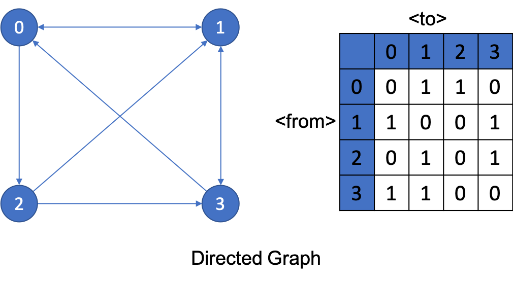
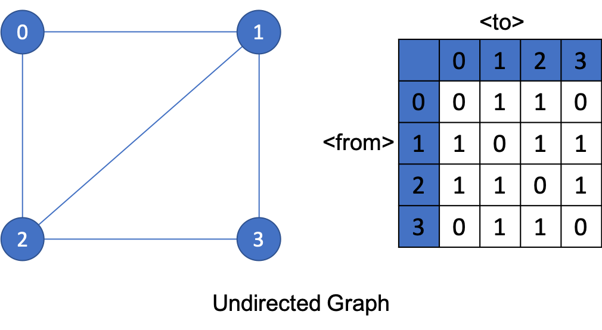
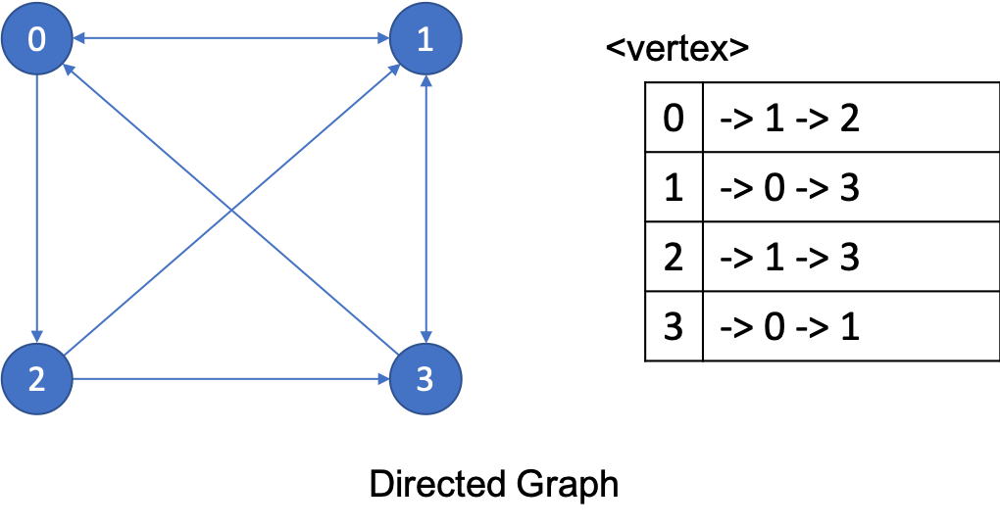
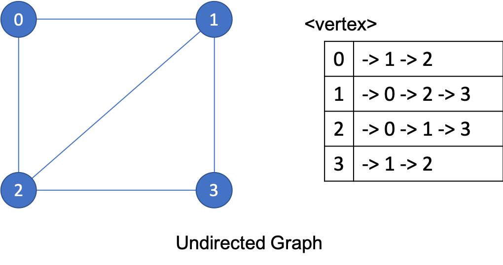

Tree
========================

그래프를 구현하기 위한 방법
* 행렬을 이용한 그래프
    * 행렬: 행과열은 정점을 나타내고 [i][j]값은 정점 i로부터 j가 연결되어있으면 1 아니면 0으로 표시
    * 가중치가 있다면 [i][j]에 가중치를 저장
* list를 이용한 그래프
    * 정점의 수만큼 리스트를 생성하고 해당 정점 리스트에다가 연결된 정점들을 추가

그래프의 종류
* 방향 그래프
    * 방향이 있는 그래프로 출발지점과 도착지점이 존재한다.
* 무방향 그래프
    * 방향이 없는 그래프로 두 정점은 다 출발지점과 도착지점이 된다.

행렬 방향 그래프  

행렬 무방향 그래프  

list 방향 그래프  

list 무방향 그래프  

 
출처 : https://twpower.github.io/72-implement-graph-in-cpp
 

구현 예시) 
* [그래프 코드](graph.cpp)

결과값 
