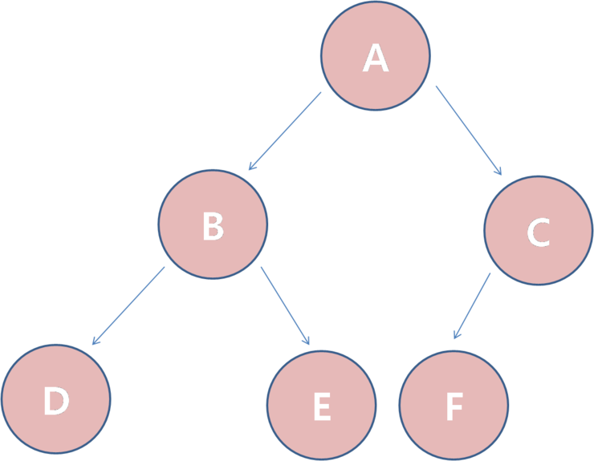

Tree
========================

tree는 대표적인 비선형구조를 가진 데이터구조이다.
비선형구조는 데이터가 계층적으로 구성되어 있다.

* Root Node : 트리 구조에서 최상위에 존재하는 노드
* Node : 트리의 구성요소에 해당하는 A,B,C,D,E,F,G,H,I,J
* Edge : 노드와 노드를 연결하는 선
* Leaf Node : 밑으로 또 다른 노드가 연결되어 있지 않은 H,I,J,F,G와 같은 노드
* Sub-Tree : 큰 트리에 속하는 작은 트리
* Level : 각 층별로 매긴 숫자. Root가 level 0, 아래로 갈 수록 level 증가
* Height : 트리의 높이 = 트리의 최고 레벨

tree의 종류 <모든 트리가 이진 트리는 아니지만 여기서는 이진트리만 다룬다.>
* 이진트리(Binary Tree) : 왼쪽, 오른쪽 두 방향으로만 연결되어 있으며, 모든 서브트리가 이진트리인 트리
    * 사향이진트리 : 한쪽 방향으로 기운 트리, 루트노드 부터 시작해서 왼쪽 혹은 오른쪽으로만 자식을 쭉 가지는 트리를 사향이진트리라고 부른다.
    
    * 완전이진트리(Complete Binary Tree) : 위에서 아래로 채워 져있으며 또한 왼쪽에서 오른쪽으로 순서대로 빈틈이 없이 채워진 이진트리
    
    * 포화 이진 트리(Full Binary Tree) : 완전이진트리면서 Height-1인 노드들이 양쪽의 자식을 모두 가지고 또한 Height의 노드들은 단 
    하나의 자식도 가지지 않는 트리
    
* 이진 탐색 트리(Binary Search Tree) : 이진트리를 배우게되면 가장 기본적이게 배우게 되는 트리. 한 노드에서 왼쪽은 자신보다 작은 수, 오른쪽은 자신보다 큰 수로 정렬되어 있는 트리.

운행(Travel) : 트리를 모두 방문하는 것을 의미
* preorder : 전위 운행은 현재 노드, 왼쪽 노드, 오른쪽 노드순으로 출력하는 방식이다.

* inorder : 중위 운행은 왼쪽 노드, 현재 노드, 오른쪽 노드순으로 출력하는 방식이다.

* postorder : 후위 운행은 왼쪽 노드, 오른쪽 노드, 현재 노드순으로 출력하는 방식이다.

구현 예시) 
* [이진 탐색 트리 코드](tree.cpp)